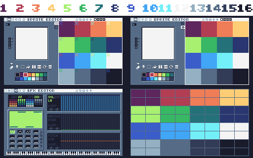

# Collab16v2

The TIC-80 Collab16v2 cartridge will be a "16-in-1" cartridge, with 16 games created by 16 different developers.

This cartridge could be a fun way to encourage collaboration within the tic-80 community, allowing 16 different developers to come together to create something together. As far as I'm aware, it would also set the record for a tic-80 cartridge with the most authors. So let's have some fun, and create something cool together!

Why v2? The first attempt at a Collab16 cartridge was maintained by Rami Sabbagh and can be found [here](https://itch.io/t/142544/cancelled-tic-80-collab16-i-developers-wanted#post-273868). The project was unfortunately cancelled, but I have identified that project's shortcomings, and have decided to try to reboot an improved version. I am planning to complete this project and have numerous open-source projects under my belt, so rest assured that your work will not go to waste.

## Technical Specs

The available space in a cartridge has been split into 16 equal parts, with each game having the following:
- 4048 Bytes/characters of code
- 16 8x8 Tiles
- 16 8x8 Sprites
- 2040 Map tiles (60x34)
- 4 Sound effects
- Up to 1 custom waveform
- Up to 1 music track

## Contributing
The splitting of assets between developers in Collab16 was inconvenient, so a simpler system has been implemented. Please follow the 3-step plan below.

#### 1. Reserve a Slot
Prior to contributing, you will have to reserve a slot for your game. A reservation will last 2 weeks to ensure that abandoned slots can be freed up for others to use, but you may ask for an extension if you are still developing your game. To reserve a slot, you may use one of the following methods:
- Create a [github issue](https://github.com/wojciech-graj/Collab16v2/issues/new) titled `Slot Reservation`.
- Comment on the [itch.io thread](https://itch.io/t/2720981/collaborative-tic-80-cart-developers-wanted).

The cartridge comes with 3 waveforms which should suffice for your sound effects, but you may request an additional waveform. You may also request a music track if you plan to add music. Both of these will be allocated on a first-come-first-serve basis while supply lasts.

Upon receiving your message, I shall reply using the same channel that you used to contact me with a Game Index that you can use, along with any auxilliary indices if you requested them. You shall also be added to the table of reservations, which can be found on this page.

#### 2. Develop
You may now begin creating your game! Based on which Game Index you have been assigned, you will be granted the right to modify all assets listed in the table and diagram below. All ranges in the table include their endpoints.



```
+----------------+---------------------------------+---------------------------------+---------------------+-------+----------------+
|   Game Index   |              Tiles              |             Sprites             |         Map         |  SFX  | Thumbnail Tile |
+----------------+---------------------------------+---------------------------------+---------------------+-------+----------------+
| Total per game | 16                              | 16                              | 2040                | 4     |                |
| 1              | 0-3,16-19,32-35,48-51           | 256-259,272-275,288-291,304-307 | (0,0)-(59,33)       | 0-3   |              0 |
| 2              | 4-7,20-23,36-39,52-55           | 260-263,276-279,292-295,308-311 | (60,0)-(119,67)     | 4-7   |              4 |
| 3              | 8-11,24-27,40-43,56-59          | 264-267,280-283,296-299,312-315 | (120,0)-(179,101)   | 8-11  |              8 |
| 4              | 12-15,28-31,44-47,60-63         | 268-271,284-287,300-303,316-319 | (180,0)-(239,135)   | 12-15 |             12 |
| 5              | 64-67,80-83,96-99,112-115       | 320-323,336-339,352-355,368-371 | (0,34)-(59,33)      | 16-19 |             64 |
| 6              | 68-71,84-87,100-103,116-119     | 324-327,340-343,356-359,372-375 | (60,34)-(119,67)    | 20-23 |             68 |
| 7              | 72-75,88-91,104-107,120-123     | 328-331,344-347,360-363,376-379 | (120,34)-(179,101)  | 24-27 |             72 |
| 8              | 76-79,92-95,108-111,124-127     | 332-335,348-351,364-367,380-383 | (180,34)-(239,135)  | 28-31 |             76 |
| 9              | 128-131,144-147,160-163,176-179 | 384-387,400-403,416-419,432-435 | (0,68)-(59,33)      | 32-35 |            128 |
| 10             | 132-135,148-151,164-167,180-183 | 388-391,404-407,420-423,436-439 | (60,68)-(119,67)    | 36-39 |            132 |
| 11             | 136-139,152-155,168-171,184-187 | 392-395,408-411,424-427,440-443 | (120,68)-(179,101)  | 40-43 |            136 |
| 12             | 140-143,156-159,172-175,188-191 | 396-399,412-415,428-431,444-447 | (180,68)-(239,135)  | 44-47 |            140 |
| 13             | 192-195,208-211,224-227,240-243 | 448-451,464-467,480-483,496-499 | (0,102)-(59,33)     | 48-51 |            192 |
| 14             | 196-199,212-215,228-231,244-247 | 452-455,468-471,484-487,500-503 | (60,102)-(119,67)   | 52-55 |            196 |
| 15             | 200-203,216-219,232-235,248-251 | 456-459,472-475,488-491,504-507 | (120,102)-(179,101) | 56-59 |            200 |
| 16             | 204-207,220-223,236-239,252-255 | 460-463,476-479,492-495,508-511 | (180,102)-(239,135) | 60-63 |            204 |
+----------------+---------------------------------+---------------------------------+---------------------+-------+----------------+
```

To start developing, dowload the base cartridge either from this repository (filename `collab16base.tic`), or from the [tic-80 website](https://tic80.com/play?cart=3256). The following bolierplate code has been provided for each game in the cartridge, where i represents your Game Index. Please edit it as you see fit.
```
G[i] = {
   N = "Game Title",
   A = "Game Author",
   T = function(self) end, -- Called every frame, equivalent to TIC
   I = function(self) end, -- Initialization function called when game is launched
}
```

Each game requires a thumbnail that will be displayed in the main menu. Its index can be found under the Thumbnail Tile heading in the above table.

To exit to the main menu, set the global variable `S` to nil value (e.g. `S=_`) and ensure that any music that may have been playing has been stopped.

Do not add your name to the `authors` comment, as I will do that during the merging process. In case you wish to be credited differently here than in your `G[i].A` string, please mention that when submitting.

#### 3. Submit

Prior to submitting, ensure the size of your game (can be found in bottom-right corner of the code editor) does not exceed 6633. Please also try to get close to this limit so all games have comparable scope.

You have 2 options as to how you wish to submit your game:
- Upload the cartige to the [tic-80 website](https://tic80.com) as a Work-in-progress cart.
- Create a pull request on github with your cartridge (renamed to `collab16.tic`) being the only changed file.

Then, contact me as you did in Step 1 with a link to the uploaded cartridge or pull request. I will then promptly merge the cartridges, and update the cartridge on the tic-80 website.

#### Code Guidelines

- Do not write to the `p`, `S`, `G`, and `I` global variables.
- Initialize all game state in the `G[i].I` function, so the game can be launched multiple times. The only things your `G[i].T` function may assume about global state should be guaranteed by `G[i].I`.
- The game must return to the menu screen after a game over. This can be done as follows `S=_`
- Try to avoid global variables, instead favoring storing all state as values in your `G[i]` table.
- Try to avoid making games that require the mouse, but do not treat this as a strict rule.
- Try to add sound effects and/or music to your game. This is, however, entirely optional.

#### License

This project is licensed under the AGPLv3.0 license, and you agree for your code to be licensed under the terms specified in said license by submitting your cartrige. More information can be found in [here](LICENSE).

## Progress

```
+------------+------------+------------+------------------------+-------------------------+
| Game Index | Author     | Completed? | Reservation Expiration | Additional Reservations |
+------------+------------+------------+------------------------+-------------------------+
|          1 | kevidryon2 | No         | 2023-04-18             |                         |
|          2 |            | No         |                        |                         |
|          3 |            | No         |                        |                         |
|          4 |            | No         |                        |                         |
|          5 |            | No         |                        |                         |
|          6 |            | No         |                        |                         |
|          7 |            | No         |                        |                         |
|          8 |            | No         |                        |                         |
|          9 |            | No         |                        |                         |
|         10 |            | No         |                        |                         |
|         11 |            | No         |                        |                         |
|         12 |            | No         |                        |                         |
|         13 |            | No         |                        |                         |
|         14 |            | No         |                        |                         |
|         15 |            | No         |                        |                         |
|         16 |            | No         |                        |                         |
+------------+------------+------------+------------------------+-------------------------+
```
